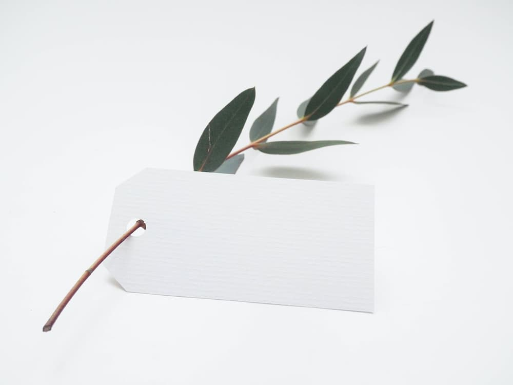

## தமிழ் வரலாற்று

பண்டைய தமிழ் வரலாற்று மூலங்கள் இலக்கிய, தொல்லியல், கல்வெட்டு, நாணய ஆய்வியல் மூலம் அறியப்படுகின்றது. இவற்றில் சங்க இலக்கியம் மிக முக்கியமானதாகும். இது கி.மு. பிற்கால இறுதி நூற்றாண்டு காலம் தொடக்கம் கி.பி ஆரம்ப காலப் பகுதிக்குரியதாகும். சங்க இலக்கிய செய்யுள்கள் பண்டைய தமிழகச் சமூகம் மற்றும் அவர்களின் வாழ்க்கையின் வேறுபட்ட பகுதிகளை வருணணை விளக்கமாக கொண்டுள்ளது. இவற்றின் பல பகுதிகளை ஆய்வாளர்கள் நம்பகமான விபரங்கள் என ஏற்றுக் கொள்கின்றனர். கிட்டத்தட்ட கிறித்தவ கால வளர்ச்சி ஏற்பட்ட காலப்பகுதி கிரேக்க உரோம இலக்கியங்கள் தமிழகத்திற்கும் உரோமைப் பேரரசுக்கும் இடையிலான கடல் வாணிபம் பற்றிய, தமிழ் நாட்டின் கரையோர பல துறைமுகங்களின் பெயர்கள் மற்றும் இடங்கள் உட்பட்ட விபரங்களைத் தருகின்றன.

தமிழ்நாடு மற்றும் கேரளத்தில் மேற்கொள்ளப்பட்ட தொல்பொருளாய்வு அகழ்வுகள் சங்க கால எச்சங்களான பல்வகை மட்பாண்டங்கள், எழுத்துக்கள் பொறிக்கப்பட்ட மட்பாண்டங்கள், தருவிக்கப்பட்ட மட்பாண்ட பொருட்கள், தொழிற்சாலைப் பொருட்கள், செங்கல் கட்டமைப்புக்கள், சுற்றும் திருகுச்சுருள் ஆகியவற்றை வெளிப்படுத்தியது. பாறைப்படிவியல், பண்டையெழுத்துமுறை நுட்பங்கள் போன்றவை சங்ககால அப்பொருட்களின் காலத்தைக் கணிக்க உதவியது. அகழ்ந்தெடுக்கப்பட்ட செயற்கைப் பொருட்கள் சங்க இலக்கியம் குறிப்பிடும் வேறுபட்ட பொருளாதார செயற்பாடுகளான விவசாயம், நெசவு, கொல்லர் வேலை, இரத்தினக் கற்கள் பட்டை தீட்டல், கட்டட கட்டுமானம், முத்து அகழ்வு, ஓவியம் ஆகியவற்றின் இருத்தலுக்கான சான்றை வழங்குகின்றது.

## தமிழர்

> தமிழர் வரலாறு
> தமிழர் பண்பாடு
> தமிழர்  
> சமயம்  
>
> *[தமிழர்](https://ta.wikipedia.org/wiki/%E0%AE%A4%E0%AE%AE%E0%AE%BF%E0%AE%B4%E0%AE%B0%E0%AF%8D)*

## 图片

  

  

```markdown
  

  
```

தமிழர் [wikipedia](https://ta.wikipedia.org/wiki/%E0%AE%A4%E0%AE%AE%E0%AE%BF%E0%AE%B4%E0%AE%B0%E0%AF%8D)
